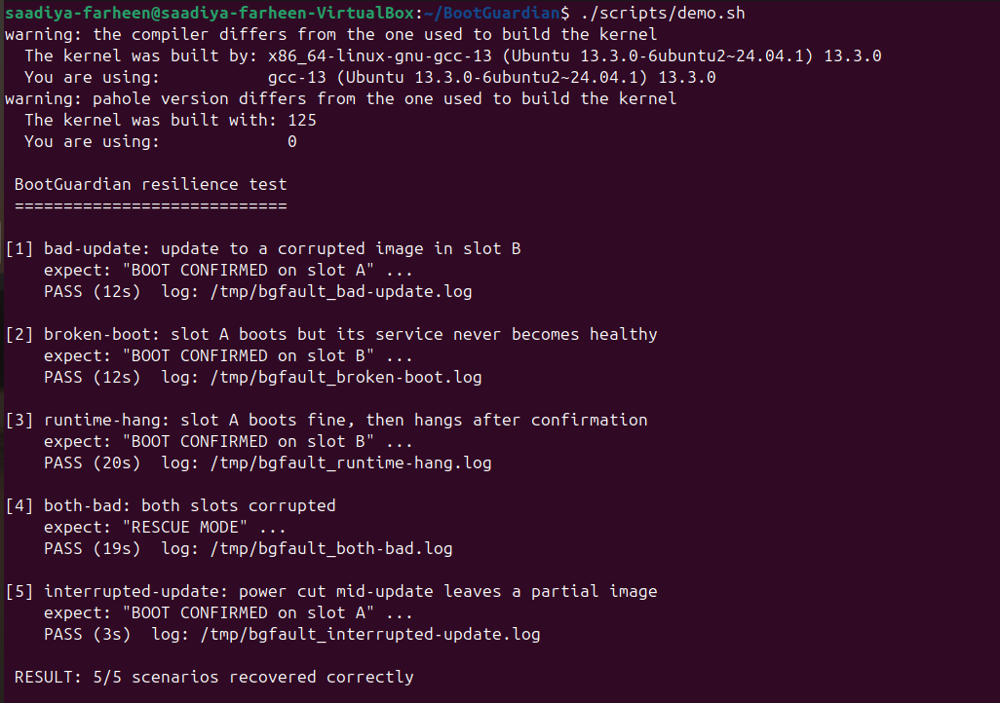

# BootGuardian

A boot-recovery system for Linux: if a bad update or a crashing service stops
the system from booting, it detects the failure and rolls back to the last
working copy on its own.

Capstone project by Saadiya Farheen. Written in C, tested on Ubuntu (kernel 6.14) in VirtualBox.

## Why this project
Devices like routers and IoT boxes can't have someone walk up and fix them
after a bad firmware update. The usual answer is two copies of the system
(A and B): update the one that isn't running, try it, and fall back if it
fails. I wanted to build that idea end to end, including the kernel part.

## How it works
There are three pieces that talk to each other:

- **`bootguard.ko`** (kernel driver) creates `/dev/bootguard`. It remembers
  which slot is active and how many boots were tried, and it runs a watchdog
  timer. If userspace stops sending heartbeats and the attempts are used up,
  the driver switches slot itself and wakes the daemon through `poll()`.
- **`bgd`** (daemon) checks system health every second. If healthy it sends a
  heartbeat; if not, it holds back. After a few good checks it confirms the boot.
- **`bgctl`** (update tool) writes a new image to the *inactive* slot, checks
  its SHA-256, and switches over for a trial boot.

```
bgctl --> /var/lib/bootguard (state, slots A/B) <-- bgd --ioctl/poll--> /dev/bootguard (driver)
```

If both slots keep failing, `bgd` stops and writes `rescue.log` instead of
looping forever.

## Test results


`bgfault` breaks the system on purpose and checks that it recovers:

| Fault injected | What the system did | Result |
|---|---|---|
| Update with a corrupted image | tried slot B 3 times, rolled back to A | PASS |
| Slot A never becomes healthy | rolled back to B | PASS |
| Slot A hangs after booting fine | watchdog fired, rolled back to B | PASS |
| Both images corrupted | entered rescue mode, wrote diagnostics | PASS |
| Power cut during an update | running slot untouched | PASS |

Output of the last run is in `docs/resilience-report.txt`.

## Build and run
```bash
sudo apt install -y build-essential linux-headers-$(uname -r)
make
./scripts/demo.sh          # loads the driver and runs all five faults (~90 s)
```
Manual use:
```bash
sudo insmod kernel/bootguard.ko timeout_sec=3 max_attempts=3
head -c 100000 /dev/urandom > /tmp/v1.img
sudo cli/bgctl init /tmp/v1.img
sudo daemon/bgd -c ./tools/bghealth -i 1
cat /proc/bootguard
```
`bgctl` commands: `init`, `update`, `verify`, `rollback`, `status`.

## Linux driver concepts used
Misc character device, `ioctl` with a shared header, `copy_to_user`/`get_user`,
`poll` and wait queues, kernel timers, `spin_lock_irqsave` (the timer callback
runs in interrupt context), `/proc` via `seq_file`, module parameters.

## Problems I ran into
- The build compiled nothing at first: my kernel Makefile used `$(PWD)`, which
  pointed at the wrong folder when run from the project root. `$(CURDIR)` fixed it.
- `no_llseek` doesn't exist on kernel 6.14; `noop_llseek` works on old and new kernels.
- The test tool got "Permission denied" on `/dev/bootguard` because udev resets
  device permissions, so the tools are run with `sudo`.

## What I learned
- The kernel and normal programs are separate. A program talks to a driver
  through a device file (`/dev/bootguard`) using `ioctl`.
- Code that runs when a timer fires can't sleep, so shared data is protected
  with a spinlock instead of a mutex.
- Writing a file safely means writing a temporary copy, forcing it to disk
  (`fsync`), then renaming it, so a power cut can't leave a half-written file.

## Limitations
- Reboot is simulated inside `bgd`; real hardware would use bootloader
  variables (U-Boot or GRUB).
- Slots are image files, not real partitions.
- The rescue counter is kept in memory only.

## Layout
```
kernel/   driver (bootguard.c, bootguard.h)
daemon/   bgd.c
cli/      bgctl.c
tools/    bgtest.c, bgfault.c, bghealth.c
scripts/  demo.sh, day1_test.sh
docs/     resilience-report.txt, demo.png
```
